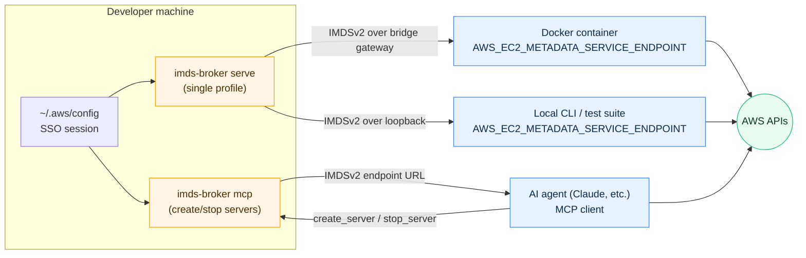
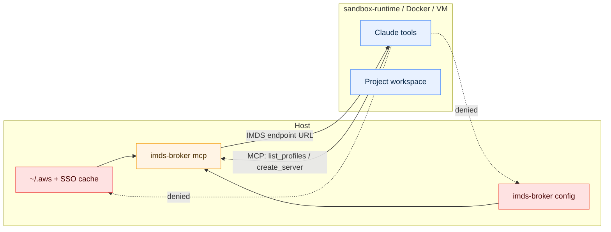

# imds-broker

**imds-broker vends AWS credentials over a local [IMDSv2](https://docs.aws.amazon.com/AWSEC2/latest/UserGuide/configuring-instance-metadata-service.html)-compatible HTTP endpoint, so any tool that expects to be running on EC2 just works — locally.**

It's for developers running Docker containers, local CLI tools, and AI agents that need AWS access without leaking long-lived credentials into environments where they don't belong. Credentials stay in your AWS config or SSO session on the host. Consumers only ever see short-lived tokens fetched from a URL.



Main commands:

- **`serve`** — run a single IMDS server for one AWS profile. Point Docker containers or local tools at it via `AWS_EC2_METADATA_SERVICE_ENDPOINT`. This is the primary day-to-day mode.
- **`mcp`** — expose an MCP stdio server so AI agents can create and stop IMDS servers on demand for specific profiles.
- **`profiles`** — list the AWS profiles that would be visible to the MCP server, as JSON. Useful for scripting.
- **`doctor`** — check the host-side broker configuration and sandbox assumptions.

## Why

Most local AWS workflows either bake credentials into a container, copy `~/.aws` into an image, or export `AWS_ACCESS_KEY_ID` into a subprocess. That's fine for throwaway work, but:

- SSO credentials expire and have to be re-exported constantly.
- Static IAM keys leak into shell history, container images, and CI logs.
- AI agents running in sandboxes often can't run `aws sso login` or assume roles themselves.

imds-broker sidesteps all of that. The consumer learns a URL. The broker, on the host, resolves credentials fresh for every request, upgrading long-lived IAM keys to short-lived STS session tokens before handing anything out.

## Installation

Pre-built binaries for Linux, macOS, and Windows (amd64/arm64) are published to
[GitHub Releases](https://github.com/jamestelfer/imds-broker/releases). Every artifact
carries a build-provenance attestation — see [Verifying releases](#verifying-releases).

<details>
<summary><strong>mise (recommended)</strong></summary>

[mise](https://mise.jdx.dev/) installs directly from GitHub Releases via its
[GitHub backend](https://mise.jdx.dev/dev-tools/backends/github.html); it
verifies the artifact checksum and, with `github_attestations` enabled (the
current default), its build-provenance attestation:

```sh
mise use -g github:jamestelfer/imds-broker
```

</details>

<details>
<summary><strong>Install script</strong></summary>

Each release ships a self-contained installer (generated with
[binstaller](https://github.com/binary-install/binstaller)) that detects your
platform and checks the download against checksums embedded in the script — no
separate checksum file is fetched:

```sh
curl -fsSL https://github.com/jamestelfer/imds-broker/releases/latest/download/install.sh | sh
```

It installs to `~/.local/bin`; pass `-b` for another directory and a tag to pin
a version:

```sh
curl -fsSL https://github.com/jamestelfer/imds-broker/releases/latest/download/install.sh \
  | sh -s -- -b /usr/local/bin <TAG>
```

The script carries a build-provenance attestation, so you can verify it before
running it (with an authenticated [GitHub CLI](https://cli.github.com/)). This
transitively covers the binary too: a verified script is guaranteed to hold the
genuine checksums it then enforces on the download.

```sh
curl -fsSL -O https://github.com/jamestelfer/imds-broker/releases/latest/download/install.sh
gh attestation verify install.sh --repo jamestelfer/imds-broker
sh install.sh
```

</details>

<details>
<summary><strong>Homebrew (macOS)</strong></summary>

```sh
brew install jamestelfer/tap/imds-broker
```

</details>

<details>
<summary><strong>npm</strong></summary>

```sh
npm install -g @jamestelfer/imds-broker
```

</details>

<details>
<summary><strong>Nix</strong></summary>

```sh
nix profile install github:jamestelfer/imds-broker
```

</details>

<details>
<summary><strong>Manual download</strong></summary>

Download the archive for your platform from the
[releases page](https://github.com/jamestelfer/imds-broker/releases), verify its
provenance, and put the binary on your `PATH`:

```sh
OS=linux ARCH=amd64   # or darwin/windows, arm64
curl -fsSLO "https://github.com/jamestelfer/imds-broker/releases/latest/download/imds-broker_${OS}_${ARCH}.tar.gz"
gh attestation verify "imds-broker_${OS}_${ARCH}.tar.gz" --repo jamestelfer/imds-broker
tar -xzf "imds-broker_${OS}_${ARCH}.tar.gz" imds-broker
install -m 0755 imds-broker ~/.local/bin/
```

Windows archives are `.zip`. See [Verifying releases](#verifying-releases) for
what the attestation proves and for checksum-only verification.

</details>

<details>
<summary><strong>go install</strong></summary>

```sh
go install github.com/jamestelfer/imds-broker/cmd/imds-broker@latest
```

</details>

## Verifying releases

Release artifacts — the binary archives and the generated `install.sh` — carry a
[build-provenance attestation](https://docs.github.com/en/actions/security-for-github-actions/using-artifact-attestations/using-artifact-attestations-to-establish-provenance-for-builds)
(SLSA) generated by the release workflow with [Sigstore](https://www.sigstore.dev/)
keyless signing — there is no long-lived signing key. Each artifact is bound, by
digest, to the source commit and the workflow that produced it.

To verify a downloaded artifact, install the [GitHub CLI](https://cli.github.com/)
(≥ 2.49.0) and run:

```sh
# e.g. ARTIFACT=imds-broker_linux_amd64.tar.gz
gh attestation verify "$ARTIFACT" --repo jamestelfer/imds-broker
```

To additionally pin the signing workflow, add
`--signer-workflow jamestelfer/imds-broker/.github/workflows/release.yml`. The
attestation is a Sigstore bundle, so [`cosign`](https://docs.sigstore.dev/) can
verify it too; `checksums.txt` is still published for
`sha256sum --check checksums.txt`.

## Usage

### `serve` — for containers and local tools

Run a single IMDS server for a named AWS profile:

```sh
imds-broker serve --profile my-profile [--region us-east-1]
```

On startup the endpoint URL is logged to stderr:

```
... INFO IMDS server listening url=http://127.0.0.1:PORT profile=my-profile
```

Point any AWS SDK at it:

```sh
export AWS_EC2_METADATA_SERVICE_ENDPOINT=http://127.0.0.1:PORT
aws s3 ls
```

#### With Docker

The broker listens on all interfaces and auto-discovers the Docker bridge gateway, so containers can reach it without `--network host`. The connection filter still rejects anything outside loopback, the Docker bridge, and your local LAN.

```sh
# Linux (host network):
docker run --rm \
  --network host \
  -e AWS_EC2_METADATA_SERVICE_ENDPOINT=http://127.0.0.1:PORT \
  amazon/aws-cli s3 ls

# macOS / Windows (Docker Desktop):
docker run --rm \
  -e AWS_EC2_METADATA_SERVICE_ENDPOINT=http://host.docker.internal:PORT \
  amazon/aws-cli s3 ls
```

No credentials enter the container — only the endpoint URL.

Use `--quiet` to suppress stderr output. The URL is also written to the log file at `~/.local/state/sandy/logs/imds-broker/`.

### `mcp` — for AI agents

`imds-broker mcp` runs an [MCP](https://modelcontextprotocol.io/) stdio server that exposes three tools: `list_profiles`, `create_server`, and `stop_server`. An agent calls `create_server` with a profile name, receives an endpoint URL, does its work with `AWS_EC2_METADATA_SERVICE_ENDPOINT` set to that URL, and calls `stop_server` when finished.

This lets an agent running in a sandboxed environment — where it has no shell access to AWS credentials and can't assume roles directly — still operate against AWS using whichever profiles the user has pre-approved.

#### Safe Claude Code setup

Use imds-broker with a real sandbox boundary: Anthropic `sandbox-runtime`, a Docker container, or a VM. Run `imds-broker mcp` outside that boundary so it is the agent's only route to host AWS credentials.

Claude Code starts MCP servers from the host context. That is the point: the broker can read host AWS config, while the agent's tools cannot. The profile filter limits which host profiles Claude can request; it does not limit what those AWS profiles can do. Use least-privilege AWS profiles for agent workflows.



Recommended Claude Code settings excerpt:

```json
{
  "permissions": {
    "disableBypassPermissionsMode": "disable",
    "deny": [
      "Read(~/.aws/**)",
      "Read(~/.config/imds-broker/**)",
      "Edit(~/.aws/**)",
      "Edit(~/.config/imds-broker/**)"
    ]
  },
  "sandbox": {
    "enabled": true,
    "failIfUnavailable": true,
    "allowUnsandboxedCommands": false
  }
}
```

Add any non-standard `AWS_CONFIG_FILE`, `AWS_SHARED_CREDENTIALS_FILE`, or `XDG_CONFIG_HOME` locations to the same `deny` list.

These `Read` and `Edit` denies block Claude's direct file tools. When sandboxing is enabled, Claude Code also merges them into the OS sandbox boundary for Bash, so subprocesses and child processes cannot read or modify those paths indirectly. That indirect block matters: without it, an allowed Bash command could run Python, Node, `aws`, or another program that opens credential files itself.

Do not add `$HOME`, `~/.aws`, `~/.config`, `~/.claude`, or the broker config directory to sandbox filesystem allow-lists.

Configure broker defaults in `${XDG_CONFIG_HOME:-$HOME/.config}/imds-broker/config.yaml`:

```yaml
profile-filter: ".*ViewOnly.*"
region: "ap-southeast-2"
log-level: "info"
```

Register the broker normally with Claude Code:

```sh
claude mcp add imds-broker -- imds-broker mcp
```

Runtime inputs override file defaults when the broker launch environment is host-controlled:

```sh
imds-broker mcp --profile-filter "my-team-.*"
IMDS_BROKER_PROFILE_FILTER="my-team-.*" imds-broker mcp
```

If Claude can read AWS credentials, edit broker config, or influence the broker process environment, the filter is advisory.

### `profiles` — list available profiles

Prints profiles matching the effective filter as a JSON array. Use it to check what the MCP server would expose to the agent:

```sh
imds-broker profiles [--profile-filter REGEX]
```

### `doctor` — check host-side setup

Runs local diagnostics for the broker setup:

```sh
imds-broker doctor
```

`doctor` reports the config path, whether a config file was found, the effective profile filter, the effective region and log level defaults, the number of discoverable local profiles, and the number matched by the filter.

`doctor` is read-only and does not call AWS APIs. It prints human-readable text for operators. It does not list matched profile names; use `imds-broker profiles` for JSON profile output.

`doctor` checks broker configuration, not container, VM, or sandbox-runtime policy. If the sandbox can read AWS credentials, edit broker config, or influence broker launch inputs, the filter is advisory.

## How it works

- Reads credentials from your local AWS config files or an active SSO session on demand.
- Validates them via STS on first use.
- Wraps static IAM credentials with STS `GetSessionToken` so clients always receive short-lived, rotatable tokens.
- Listens on an ephemeral port on all interfaces, but the listener is fail-closed: connections from anywhere outside loopback, the Docker bridge network, and your LAN are rejected before any HTTP parsing.
- Fully implements the IMDSv2 token + metadata flow, so any AWS SDK that supports EC2 instance credential resolution works, including older SDKs that pre-date newer credential providers.

## Caveats

- **AWS credentials must already exist on the host.** The broker reads from local AWS config or an active SSO session; it does not mint credentials from nothing.
- **Ports are ephemeral.** Each server binds to a random available port. Read it from stderr or the log file and pass it to your container or tool. There is no option to pin a fixed port yet.
- **Default profile filter is restrictive.** Configure `profile-filter` in `${XDG_CONFIG_HOME:-$HOME/.config}/imds-broker/config.yaml` if your profile names do not match the built-in default. Use runtime filter overrides only from host-controlled launch configuration.
- **No persistent state.** When the broker process exits, all running servers stop. Clients caching the endpoint will need to reconnect after a restart.
- **Docker Desktop networking.** `--network host` isn't supported on Docker Desktop; use `host.docker.internal` instead. The Linux Docker bridge is discovered automatically.

## Acknowledgements

The IMDSv2 token design and error handling are derived from Ben Kehoe's [imds-credential-server](https://github.com/benkehoe/imds-credential-server). Thanks to Ben for the original implementation and releasing it for others to discover.
