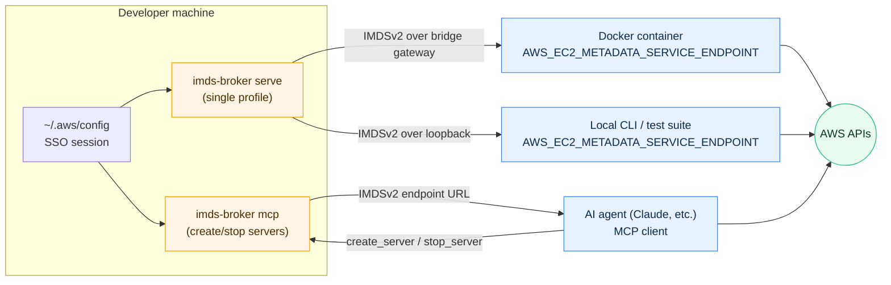

# imds-broker

**imds-broker vends real AWS credentials over a local [IMDSv2](https://docs.aws.amazon.com/AWSEC2/latest/UserGuide/configuring-instance-metadata-service.html)-compatible HTTP endpoint, so any tool that expects to be running on EC2 just works — locally.**

It's for developers running Docker containers, local CLI tools, and AI agents that need AWS access without leaking long-lived credentials into environments where they don't belong. Credentials stay in your AWS config or SSO session on the host. Consumers only ever see short-lived tokens fetched from a URL.



Three ways to use it:

- **`serve`** — run a single IMDS server for one AWS profile. Point Docker containers or local tools at it via `AWS_EC2_METADATA_SERVICE_ENDPOINT`. This is the primary day-to-day mode.
- **`mcp`** — expose an MCP stdio server so AI agents can create and stop IMDS servers on demand for specific profiles.
- **`profiles`** — list the AWS profiles that would be visible to the MCP server, as JSON. Useful for scripting.

## Why

Most local AWS workflows either bake credentials into a container, copy `~/.aws` into an image, or export `AWS_ACCESS_KEY_ID` into a subprocess. That's fine for throwaway work, but:

- SSO credentials expire and have to be re-exported constantly.
- Static IAM keys leak into shell history, container images, and CI logs.
- AI agents running in sandboxes often can't run `aws sso login` or assume roles themselves.

imds-broker sidesteps all of that. The consumer learns a URL. The broker, on the host, resolves credentials fresh for every request, upgrading long-lived IAM keys to short-lived STS session tokens before handing anything out.

## Installation

### Homebrew (macOS)

```sh
brew install jamestelfer/tap/imds-broker
```

### npm

```sh
npm install -g @jamestelfer/imds-broker
```

### mise

[mise](https://mise.jdx.dev/) installs directly from GitHub Releases via the [github backend](https://mise.jdx.dev/dev-tools/backends/github.html):

```sh
mise use -g github:jamestelfer/imds-broker
```

### Manual download

Pre-built binaries for Linux, macOS, and Windows (amd64/arm64) are on the [releases page](https://github.com/jamestelfer/imds-broker/releases). Download the archive for your OS and architecture, extract, and place the binary on your `PATH`.

## Usage

### `serve` — for containers and local tools

Run a single IMDS server for a named AWS profile:

```sh
imds-broker serve --profile my-profile [--region us-east-1]
```

On startup the endpoint URL is logged to stderr:

```
... INFO IMDS server listening url=http://127.0.0.1:PORT profile=my-profile
```

Point any AWS SDK at it:

```sh
export AWS_EC2_METADATA_SERVICE_ENDPOINT=http://127.0.0.1:PORT
aws s3 ls
```

#### With Docker

The broker listens on all interfaces and auto-discovers the Docker bridge gateway, so containers can reach it without `--network host`. The connection filter still rejects anything outside loopback, the Docker bridge, and your local LAN.

```sh
# Linux (host network):
docker run --rm \
  --network host \
  -e AWS_EC2_METADATA_SERVICE_ENDPOINT=http://127.0.0.1:PORT \
  amazon/aws-cli s3 ls

# macOS / Windows (Docker Desktop):
docker run --rm \
  -e AWS_EC2_METADATA_SERVICE_ENDPOINT=http://host.docker.internal:PORT \
  amazon/aws-cli s3 ls
```

No credentials enter the container — only the endpoint URL.

Use `--quiet` to suppress stderr output. The URL is also written to the log file at `~/.local/state/sandy/logs/imds-broker/`.

### `mcp` — for AI agents

`imds-broker mcp` runs an [MCP](https://modelcontextprotocol.io/) stdio server that exposes three tools: `list_profiles`, `create_server`, and `stop_server`. An agent calls `create_server` with a profile name, receives an endpoint URL, does its work with `AWS_EC2_METADATA_SERVICE_ENDPOINT` set to that URL, and calls `stop_server` when finished.

This lets an agent running in a sandboxed environment — where it has no shell access to AWS credentials and can't assume roles directly — still operate against AWS using whichever profiles the user has pre-approved.

Add to your MCP client config (`claude_desktop_config.json`, `.cursor/mcp.json`, Claude Code, etc.):

```json
{
  "mcpServers": {
    "imds-broker": {
      "command": "imds-broker",
      "args": ["mcp"]
    }
  }
}
```

For Claude Code specifically:

```sh
claude mcp add imds-broker -- imds-broker mcp
```

By default, only profiles matching the regex `ReadOnly|ViewOnly` are exposed to the agent. Override via flag or env var:

```sh
imds-broker mcp --profile-filter "my-team-.*"
# or:
IMDS_BROKER_PROFILE_FILTER="my-team-.*" imds-broker mcp
```

### `profiles` — list available profiles

Prints profiles matching the filter as a JSON array. Handy for scripts, or for checking what the MCP server would expose before wiring it up to an agent:

```sh
imds-broker profiles [--profile-filter REGEX]
```

## How it works

- Reads credentials from your local AWS config files or an active SSO session on demand.
- Validates them via STS on first use.
- Wraps static IAM credentials with STS `GetSessionToken` so clients always receive short-lived, rotatable tokens.
- Listens on an ephemeral port on all interfaces, but the listener is fail-closed: connections from anywhere outside loopback, the Docker bridge network, and your LAN are rejected before any HTTP parsing.
- Fully implements the IMDSv2 token + metadata flow, so any AWS SDK that supports EC2 instance credential resolution works, including older SDKs that pre-date newer credential providers.

## Caveats

- **AWS credentials must already exist on the host.** The broker reads from local AWS config or an active SSO session; it does not mint credentials from nothing.
- **Ports are ephemeral.** Each server binds to a random available port. Read it from stderr or the log file and pass it to your container or tool. There is no option to pin a fixed port yet.
- **Default profile filter is restrictive.** `ReadOnly|ViewOnly` only. If your profiles use different naming, set `--profile-filter` explicitly (e.g. `--profile-filter ".*"`).
- **No persistent state.** When the broker process exits, all running servers stop. Clients caching the endpoint will need to reconnect after a restart.
- **Docker Desktop networking.** `--network host` isn't supported on Docker Desktop; use `host.docker.internal` instead. The Linux Docker bridge is discovered automatically.

## Acknowledgements

The IMDSv2 token design and error handling are derived from Ben Kehoe's [imds-credential-server](https://github.com/benkehoe/imds-credential-server). Thanks to Ben for the original implementation and releasing it for others to discover.
